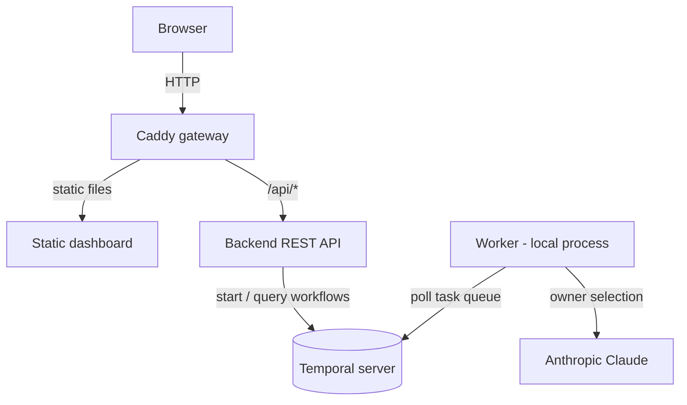

# replay-to-repair

Turns a Temporal event history into a permanent regression test. This is a
conference/workshop demo that shows how to debug a production failure by
replaying the **exact payload** that flowed through the system — no guessing,
no synthetic data — reproducing the bug locally, writing a test from the
captured input, fixing it, and redeploying under real conditions.

The scenario: an AI triage agent assigns incoming issues to developers
("owners") based on their specialties. In production, every recent issue lands
on the same owner. The root cause is a debug line accidentally committed in the
owner-selection Activity — an early return that short-circuits the LLM call.
Because the bug lives in the **Activity**, replaying the Workflow alone (which
reuses recorded Activity results) does not reproduce it: the real Activity
input must be extracted from the history and executed directly.

## Features

- **Replay-to-repair workflow** — extract the real Activity input from a
  downloaded event history and turn it into a JUnit regression test.
- **Temporal as the only source of truth** — no database anywhere; workflow
  state and history live entirely in Temporal.
- **Live-restartable worker** — the worker runs as a local process (not in
  containers) so it can be rebuilt and redeployed mid-demo in seconds.
- **Graceful degradation** — reading a workflow's state works whether it is
  running, completed, or the worker is momentarily offline (e.g. mid-redeploy).
- **No build-step frontend** — a single static dashboard (Tailwind Play CDN +
  Alpine.js) served through a Caddy gateway.

## Project status

The repository is bootstrapped and fully buildable. The Temporal wiring,
dashboard, gateway, and container stack are in place, with a **placeholder**
owner-selection Activity. The triage business logic, the fictional owner/issue
dataset, the injected bug, the event-history extraction utility, and the JUnit
replay test are the next implementation step (see [The demo](#the-demo)).

## Prerequisites

- **JDK 25** (each module ships a Maven wrapper — no separate Maven install)
- **Docker** or **Podman** with the Compose plugin
- **Anthropic API key** — the owner-selection Activity calls Claude via
  Spring AI
- **Temporal CLI** (optional) — handy for inspecting workflows; the Web UI at
  <http://localhost:8233> covers the demo needs

## Getting Started

```bash
# 1. Provide your Anthropic API key (git-ignored)
echo 'ANTHROPIC_API_KEY=your-api-key' > .env.local

# 2. Launch the app (Ctrl-C to stop the local processes)
make app-up

# 3. Open the dashboard
open http://localhost:8080
```

The Temporal Web UI is available at <http://localhost:8233>.

### Two ways to run

The **worker always runs locally** (never containerized) so it can be rebuilt
and redeployed in seconds during the demo. The two entry points differ only in
where the backend runs:

- `make app-up` — backend, gateway, and Temporal run in containers; the worker
  runs locally. This is the demo topology (redeploy the worker while the rest
  keeps running).
- `make dev` — backend **and** worker run locally with hot reload (for IDE
  debugging); only Temporal and the gateway stay in containers.

Both serve the dashboard at <http://localhost:8080> and run the local processes
in the foreground; press Ctrl-C to stop them, then `make app-down` to remove the
containers. Run `make` (or `make help`) to list every target.

## The demo

The end-to-end narrative the tooling drives (target flow):

1. Trigger a batch of issues from the dashboard → everything lands on a single
   owner.
2. Find the failing Workflow Execution in the Temporal Web UI and download its
   event history as JSON.
3. Load the history, locate the owner-selection Activity's scheduled input, and
   decode it back into a real object.
4. Run a JUnit test that exercises the Activity directly with that captured
   input (set a breakpoint), asserting a different owner should have been
   chosen → red.
5. Remove the debug early return → fix the bug.
6. Re-run the same test → green.
7. Rebuild and redeploy the worker only — the backend, gateway, and dashboard
   keep running throughout.
8. Submit a new issue under real conditions → verify a correct distribution of
   assignments.

## Usage

```bash
make app-up      # run the app: backend containerized, worker local (demo mode)
make dev         # run the app: backend + worker local, hot reload (dev mode)
make app-down    # stop and remove the containers
make app-logs    # follow logs from the running containers
make infra-up    # start only Temporal + gateway in containers
make infra-down  # stop Temporal + gateway
make test        # run the test suite for both Maven modules
make build       # build the production JARs for both modules
```

## Configuration

| Variable            | Description                          | Default          |
| ------------------- | ------------------------------------ | ---------------- |
| `ANTHROPIC_API_KEY` | Anthropic key for the worker's LLM   | (required)       |
| `ANTHROPIC_MODEL`   | Claude model used for owner triage   | `claude-sonnet-5`|
| `TEMPORAL_ADDRESS`  | Temporal gRPC endpoint               | `localhost:7233` |
| `TEMPORAL_NAMESPACE`| Temporal namespace                   | `default`        |
| `PORT`              | Backend HTTP port                    | `8080`           |

Put local values in `.env.local` (git-ignored); `make` loads it automatically
for dev and test targets.

## Architecture



The `backend` and `worker` are independent Maven projects with no shared parent
or common module — shared types are duplicated in each rather than extracted.

| Module     | Description                                                     |
| ---------- | --------------------------------------------------------------- |
| `backend`  | Spring Boot REST API; Temporal client that starts/queries flows |
| `worker`   | Spring Boot Temporal worker; hosts the triage workflow/activity |
| `frontend` | Static dashboard (Tailwind CDN + Alpine.js), no build step      |
| `gateway`  | Caddy config serving the frontend and proxying `/api/*`         |

## License

This project is licensed under the Apache-2.0 License — see [LICENSE](LICENSE)
for details.
