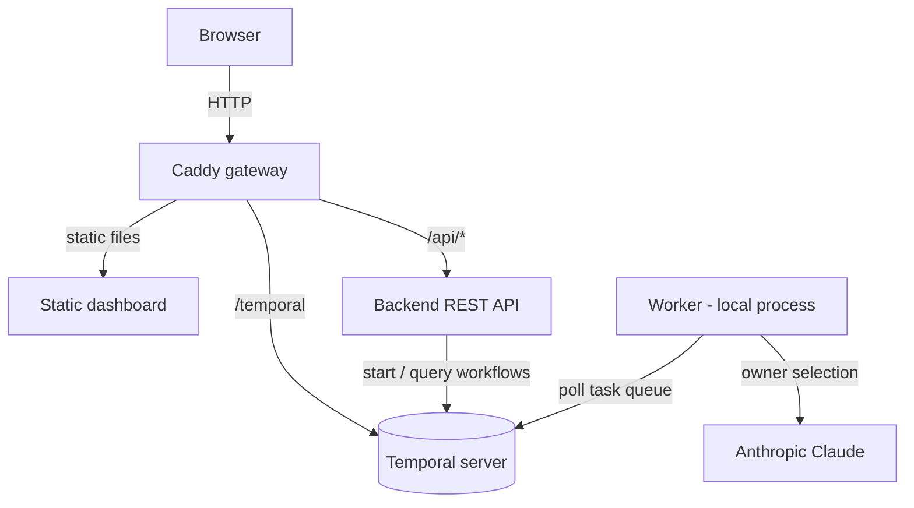

# Replay-to-Repair

Temporal durably records the complete event history of every Workflow
Execution — every input and every result, in order. That unlocks something no
ordinary system can offer: take the exact history of a failure that happened in
**production** and replay it, deterministically, on a **local dev machine** —
stepping through the real execution in a debugger with the very payload that
triggered the bug.

This is a conference/workshop demo built on that capability. It captures the
event history of a production failure and replays that exact Workflow Execution
on a local dev machine — no guessing, no synthetic data — so you can step
through the real run in your IDE debugger, pinpoint the bug, fix it, and
redeploy the worker under real conditions.

The scenario: an AI triage agent assigns incoming issues to developers
("owners") based on their specialties. In production, every recent issue lands
on the same owner. The root cause is a debug line accidentally committed in the
owner-selection Activity — an early return that short-circuits the LLM call.
Once the source of the failure is pinpointed in the **Activity**, the fix
becomes straightforward — and it ships to production faster.

## Prerequisites

- **JDK 25** (each module ships a Maven wrapper — no separate Maven install)
- **Docker** or **Podman** with the Compose plugin
- **Anthropic API key** — the owner-selection Activity calls Claude via
  Spring AI
- **Temporal CLI** (optional) — used by `make capture-history` and the manual
  capture route to export a Workflow's event history; the Web UI at
  <http://localhost:8080/temporal> is another way and covers the rest of the
  demo needs

## Getting Started

```bash
# 1. Provide your Anthropic API key (git-ignored)
echo 'ANTHROPIC_API_KEY=your-api-key' > .env.local

# 2. Launch the app (Ctrl-C to stop the local processes)
make app-up

# 3. Open the dashboard
open http://localhost:8080
```

The Temporal Web UI is available at <http://localhost:8080/temporal> — it is
served through the gateway, not on a separate port.

### Two ways to run

The **worker always runs locally** (never containerized) so it can be rebuilt
and redeployed in seconds during the demo. The two entry points differ only in
where the backend runs:

- `make app-up` — backend, gateway, and Temporal run in containers; the worker
  runs locally. This is the demo topology (redeploy the worker while the rest
  keeps running).
- `make dev` — backend **and** worker run locally with hot reload (for IDE
  debugging); only Temporal and the gateway stay in containers.

Both serve the dashboard at <http://localhost:8080> and run the local processes
in the foreground; press Ctrl-C to stop them, then `make app-down` to remove the
containers. Run `make` (or `make help`) to list every target.

### Ports

The gateway on `8080` is the single browser entry point.

| Port   | Service                                                      |
| ------ | ------------------------------------------------------------ |
| `8080` | Gateway: dashboard, `/api/*` → backend, `/temporal` → Web UI |
| `7233` | Temporal gRPC (workers and the backend connect here)         |
| `8081` | Local backend, `make dev` only (the gateway proxies to it)   |

## The demo

The end-to-end narrative the tooling drives (target flow):

1. Trigger a batch of issues from the dashboard → everything lands on a single
   owner.
2. Open the failing Workflow Execution in the Temporal Web UI: the
   owner-selection Activity keeps returning the same owner.
3. Capture that execution's event history as JSON and save it to
   `worker/src/test/resources/history/issue-triage.json` (see
   [Capturing the event history](#capturing-the-event-history)).
4. Replay the Workflow from that file with the `IssueTriageWorkflowReplayTest`
   JUnit test: set breakpoints in `IssueTriageWorkflowImpl` and step through the
   real production execution in your IDE. Replay feeds the **recorded** Activity
   results back in — the Activity code is not re-run — so the Workflow path is
   reproduced deterministically, pointing you straight at the owner-selection
   Activity.
5. Inspect that Activity and spot the committed debug early return that
   short-circuits the LLM call.
6. Remove the debug early return → fix the bug.
7. Rebuild and redeploy the worker only — the backend, gateway, and dashboard
   keep running throughout.
8. Submit new issues under real conditions → verify a correct distribution of
   assignments.

### Capturing the event history

With the app running and at least one issue triaged, the quickest route is:

```bash
make capture-history
```

It finds the most recent `IssueTriageWorkflow` execution and writes its event
history to `worker/src/test/resources/history/issue-triage.json` (needs the
Temporal CLI and `jq`). Two manual routes produce the same replay-compatible
JSON:

- **Temporal Web UI** — open the Workflow Execution at
  <http://localhost:8080/temporal>, then use **Download** on the history view to
  export the event history as JSON.
- **Temporal CLI** — export it straight to the fixture path:

  ```bash
  temporal workflow show \
      --workflow-id <workflow-id> \
      --output json \
      > worker/src/test/resources/history/issue-triage.json
  ```

  The CLI targets the Temporal gRPC endpoint on `localhost:7233` (its default)
  and namespace `default`.

`IssueTriageWorkflowReplayTest` runs as part of `make test`. If the Workflow
changes incompatibly with the committed history, refresh the fixture as above.
For the demo, run the test from your IDE debugger with breakpoints in the
Workflow to step through the real execution. Replay guards Workflow determinism;
the Activity bug is found by stepping through it, not by the test failing.

When debugging in the IDE, set `TEMPORAL_DEBUG=true` (an environment variable,
or `-DTEMPORAL_DEBUG=true` in the run configuration's VM options) to turn off
Temporal's deadlock detector. Otherwise pausing on a breakpoint for more than a
second trips a `PotentialDeadlockException` (TMPRL1101), because the SDK cannot
tell a debugger pause from a genuine block. Leave it unset for `make test` and
CI so real deadlock detection stays active.

## Usage

```bash
make app-up      # run the app: backend containerized, worker local (demo mode)
make dev         # run the app: backend + worker local, hot reload (dev mode)
make app-down    # stop and remove the containers
make infra-up    # start only Temporal + gateway in containers
make infra-down  # stop Temporal + gateway
make test        # run the test suite for both Maven modules
make build       # build the production JARs for both modules
```

## Configuration

| Variable            | Description                          | Default          |
| ------------------- | ------------------------------------ | ---------------- |
| `ANTHROPIC_API_KEY` | Anthropic key for the worker's LLM   | (required)       |
| `ANTHROPIC_MODEL`   | Claude model used for owner triage   | `claude-sonnet-5`|
| `TEMPORAL_ADDRESS`  | Temporal gRPC endpoint               | `localhost:7233` |
| `TEMPORAL_NAMESPACE`| Temporal namespace                   | `default`        |
| `PORT`              | Backend HTTP port                    | `8080`           |

Put local values in `.env.local` (git-ignored); `make` loads it automatically
for dev and test targets.

## Architecture



The `backend` and `worker` are independent Maven projects with no shared parent
or common module — shared types are duplicated in each rather than extracted.

| Module     | Description                                                     |
| ---------- | --------------------------------------------------------------- |
| `backend`  | Spring Boot REST API; Temporal client that starts/queries flows |
| `worker`   | Spring Boot Temporal worker; hosts the triage workflow/activity |
| `frontend` | Static dashboard (Tailwind CDN + Alpine.js), no build step      |
| `gateway`  | Caddy: serves the frontend, proxies `/api/*` and `/temporal`    |

## License

This project is licensed under the Apache-2.0 License — see [LICENSE](LICENSE)
for details.
