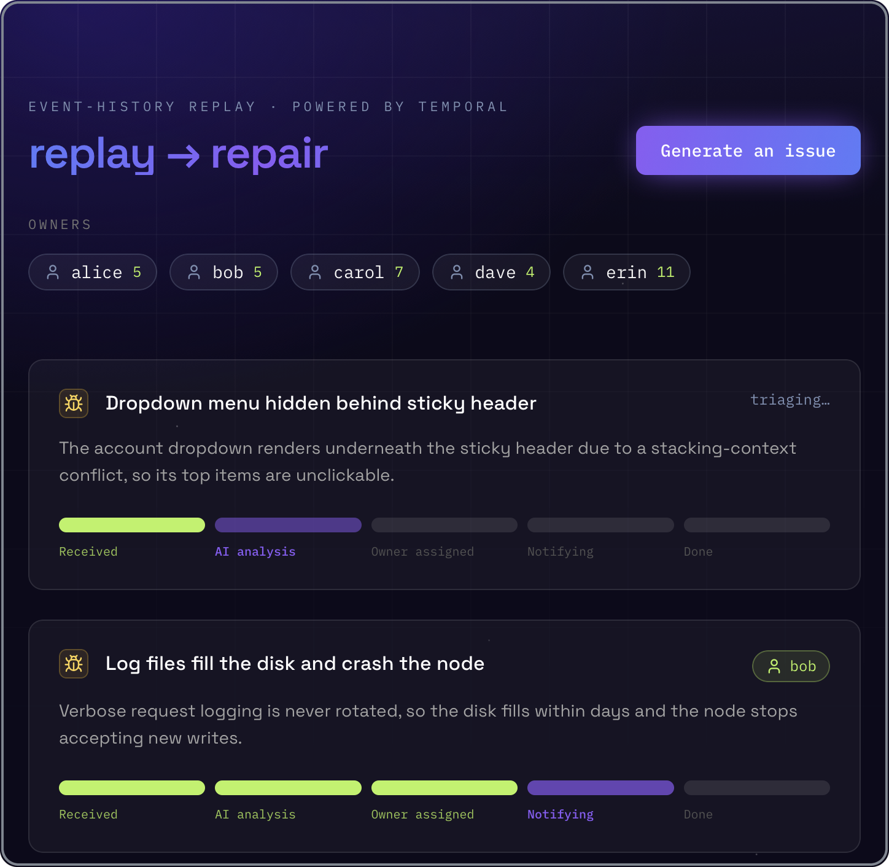
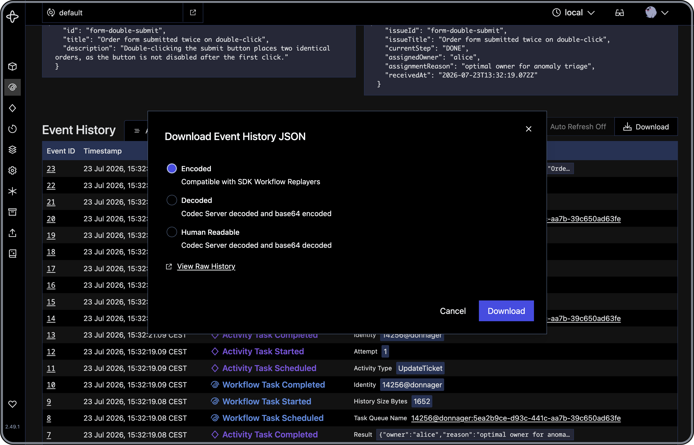
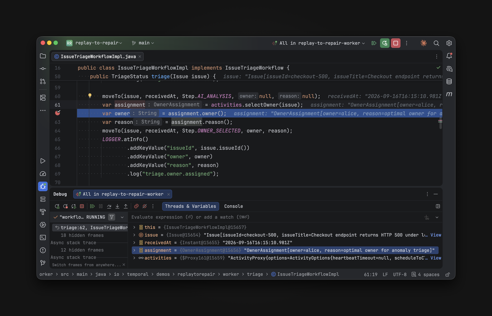
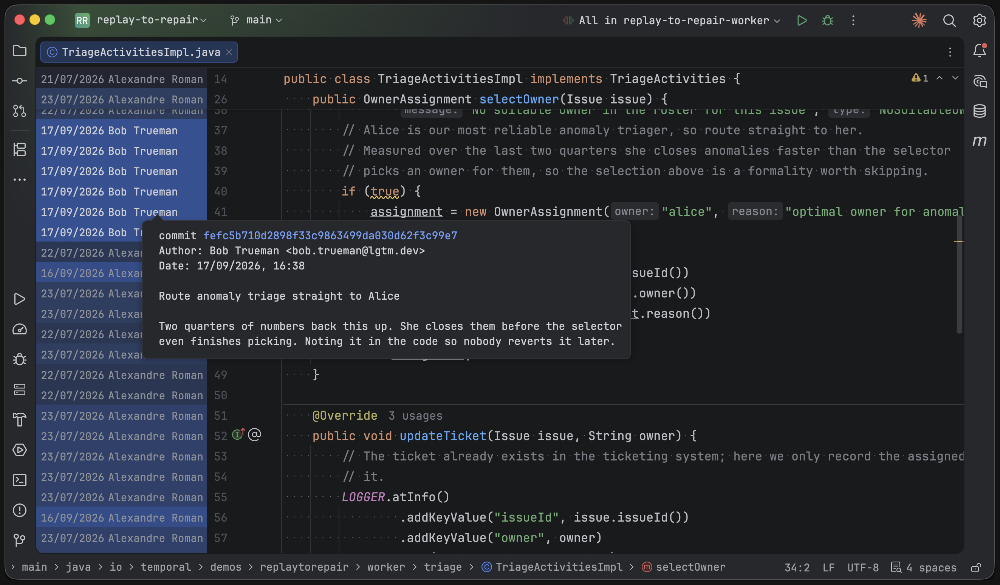
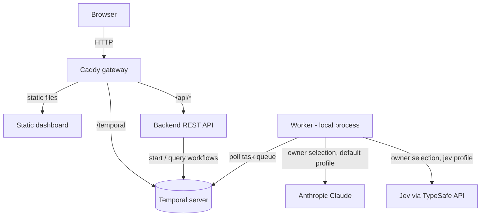

# Replay-to-Repair

Temporal durably records the complete event history of every Workflow
Execution — every input and every result, in order. That unlocks something no
ordinary system can offer: take the exact history of a failure that happened in
**production** and replay it, deterministically, on a **local dev machine** —
stepping through the real execution in a debugger with the very payload that
triggered the bug.



This is a conference/workshop demo built on that capability. It captures the
event history of a production failure and replays that exact Workflow Execution
on a local dev machine — no guessing, no synthetic data — so you can step
through the real run in your IDE debugger, pinpoint the bug, fix it, and
redeploy the worker under real conditions.

The scenario: an AI triage agent assigns incoming issues to developers
("owners") based on their specialties. Owner selection sits behind a
swappable engine — by default an LLM driven by a **skill**, a
[`SKILL.md`](worker/src/main/resources/skills/issue-triage/SKILL.md) file
holding the owner roster and routing rules, which the agent loads as a tool
(see [Owner-selection engines](#owner-selection-engines)). In production,
every recent issue lands on the same owner. The root cause sits in the
owner-selection Activity: it genuinely asks the selection engine for the
right owner and gets back a sound answer — then discards it, unconditionally
overwriting the result with the same hard-coded owner. Once the source of the
failure is pinpointed in the **Activity**, the fix becomes straightforward —
and it ships to production faster.

## Prerequisites

- **JDK 25** (each module ships a Maven wrapper — no separate Maven install)
- **Docker** or **Podman** with the Compose plugin
- **Anthropic API key** — the default owner-selection engine calls Claude via
  Spring AI. The Jev engine (`make app-up-jev` / `make dev-jev`) calls Jev
  through TypeSafe's own API and needs a TypeSafe key instead (see
  [Configuration](#configuration))
- **Temporal CLI** (optional) — used by `make capture-history` and the manual
  capture route to export a Workflow's event history; the Web UI at
  <http://localhost:8080/temporal> is another way and covers the rest of the
  demo needs

## Getting Started

```bash
# 1. Provide your Anthropic API key (git-ignored)
echo 'ANTHROPIC_API_KEY=your-api-key' > .env

# 2. Launch the app (Ctrl-C to stop the local processes)
make app-up

# 3. Open the dashboard
open http://localhost:8080
```

> [!NOTE]
> `make app-up-jev` (or `make dev-jev`) runs the worker with the Jev
> owner-selection engine instead: it needs `TYPESAFE_AI_API_KEY` in `.env`,
> not the Anthropic key.

The Temporal Web UI is available at <http://localhost:8080/temporal> — it is
served through the gateway, not on a separate port.

### Two ways to run

The **worker always runs locally** (never containerized) so it can be rebuilt
and redeployed in seconds during the demo. The two entry points differ only in
where the backend runs:

- `make app-up` — backend, gateway, Temporal, and a Markdown renderer run in
  containers; the worker runs locally. This is the demo topology (redeploy the
  worker while the rest keeps running).
- `make dev` — backend **and** worker run locally with hot reload (for IDE
  debugging); Temporal, the gateway, and the Markdown renderer stay in
  containers.

Each has a `-jev` variant — `make app-up-jev` and `make dev-jev` — that runs
the worker with the Jev owner-selection engine. Only the worker's engine
changes; the topology is the same.

The Markdown renderer is not part of the demo's design: it works around an
upstream Temporal Web UI defect, pending an upstream fix.

Both serve the dashboard at <http://localhost:8080> and run the local processes
in the foreground; press Ctrl-C to stop them, then `make app-down` to remove the
containers. Run `make` (or `make help`) to list every target.

### Owner-selection engines

Owner selection sits behind the `OwnerSelector` interface, with one
implementation active per Spring profile:

- **Spring AI + Claude** — the default (`@Profile("!jev")`). The roster is
  read model-side: the model loads
  [`SKILL.md`](worker/src/main/resources/skills/issue-triage/SKILL.md) as a
  tool and answers with the chosen owner and a one-sentence reason.
- **Jev** — the `jev` profile. A `RestClient` call to Jev, TypeSafe's
  decision model, through TypeSafe's own API. Jev calls no tools and writes
  no prose, so the roster is configured Java-side in
  [`application-jev.yaml`](worker/src/main/resources/application-jev.yaml)
  (`triage.roster`), and the assignment reason is composed from the matched
  roster entry and the reported confidence.

The roster therefore exists twice, once per engine, and
`TriageRosterConsistencyTest` holds the two copies in step — edit them
together.

Both engines are genuinely asked for an owner, and the demo's bug discards
either answer the same way: the engine choice changes nothing about the
narrative.

### Ports

The gateway on `8080` is the single browser entry point.

| Port   | Service                                                      |
| ------ | ------------------------------------------------------------ |
| `8080` | Gateway: dashboard, `/api/*` → backend, `/temporal` → Web UI |
| `7233` | Temporal gRPC (workers and the backend connect here)         |
| `8081` | Local backend, `make dev` only (the gateway proxies to it)   |

## The demo

The end-to-end narrative the tooling drives (target flow):

1. Trigger a batch of issues from the dashboard → everything lands on a single
   owner.
2. Open the failing Workflow Execution in the Temporal Web UI: the
   owner-selection Activity keeps returning the same owner.
3. Capture that execution's event history as JSON and save it to
   `worker/src/test/resources/history/issue-triage.json` (see
   [Capturing the event history](#capturing-the-event-history)).
4. Replay the Workflow from that file with the `IssueTriageWorkflowReplayTest`
   JUnit test: set breakpoints in `IssueTriageWorkflowImpl` and step through the
   real production execution in your IDE. Replay feeds the **recorded** Activity
   results back in — the Activity code is not re-run — so the Workflow path is
   reproduced deterministically, pointing you straight at the owner-selection
   Activity.
5. Inspect that Activity: the selection engine is genuinely asked and
   returns a sound answer, then the code immediately overwrites it with the
   same hard-coded owner.
6. Remove the hard-coded override that discards the engine's answer → fix
   the bug.
7. Rebuild and redeploy the worker only — the backend, gateway, and dashboard
   keep running throughout.
8. Submit new issues under real conditions → verify a correct distribution of
   assignments.

> [!TIP]
> When debugging in the IDE (step 4), set `TEMPORAL_DEBUG=true` (an environment
> variable, or `-DTEMPORAL_DEBUG=true` in the run configuration's VM options) to
> turn off Temporal's deadlock detector. Otherwise pausing on a breakpoint for
> more than a second trips a `PotentialDeadlockException` (TMPRL1101), because
> the SDK cannot tell a debugger pause from a genuine block. Leave it unset for
> `make test` and CI so real deadlock detection stays active.







### Capturing the event history

With the app running and at least one issue triaged, the quickest route is:

```bash
make capture-history
```

It finds the most recent `IssueTriageWorkflow` execution and writes its event
history to `worker/src/test/resources/history/issue-triage.json` (needs the
Temporal CLI and `jq`). Two manual routes produce the same replay-compatible
JSON:

- **Temporal Web UI** — open the Workflow Execution at
  <http://localhost:8080/temporal>, then use **Download** on the history view to
  export the event history as JSON.
- **Temporal CLI** — export it straight to the fixture path:

  ```bash
  temporal workflow show \
      --workflow-id <workflow-id> \
      --output json \
      > worker/src/test/resources/history/issue-triage.json
  ```

  The CLI targets the Temporal gRPC endpoint on `localhost:7233` (its default)
  and namespace `default`.

`IssueTriageWorkflowReplayTest` runs as part of `make test`. If the Workflow
changes incompatibly with the committed history, refresh the fixture as above.
For the demo, run the test from your IDE debugger with breakpoints in the
Workflow to step through the real execution. Replay guards Workflow determinism;
the Activity bug is found by stepping through it, not by the test failing.

## Usage

```bash
make app-up      # run the app: backend containerized, worker local (demo mode)
make app-up-jev  # same as app-up, worker runs the Jev owner-selection engine
make dev         # run the app: backend + worker local, hot reload (dev mode)
make dev-jev     # same as dev, worker runs the Jev owner-selection engine
make app-down    # stop and remove the containers
make infra-up    # start Temporal + gateway + Markdown renderer in containers
make infra-down  # stop Temporal + gateway + Markdown renderer
make test        # run the test suite for both Maven modules
make build       # build the production JARs for both modules
```

## Configuration

| Variable              | Description                          | Default          |
| --------------------- | ------------------------------------ | ---------------- |
| `ANTHROPIC_API_KEY`   | Anthropic key for the default engine | (required)       |
| `ANTHROPIC_MODEL`     | Claude model used for owner triage   | `claude-sonnet-5`|
| `TYPESAFE_AI_API_KEY` | TypeSafe key for the Jev engine      | (jev only)       |
| `TEMPORAL_ADDRESS`    | Temporal gRPC endpoint               | `localhost:7233` |
| `TEMPORAL_NAMESPACE`  | Temporal namespace                   | `default`        |

The Jev endpoint and model id (`triage.jev.*`) are not environment variables:
they live in
[`application-jev.yaml`](worker/src/main/resources/application-jev.yaml).

Put local values, including secrets, in `.env` (git-ignored); `make` loads it
automatically.

## Architecture


```mermaid
graph TD
    Browser -->|HTTP| Gateway[Caddy gateway]
    Gateway -->|static files| Frontend[Static dashboard]
    Gateway -->|/api/*| Backend[Backend REST API]
    Gateway -->|/temporal| Temporal[(Temporal server)]
    Backend -->|start / query workflows| Temporal
    Worker[Worker - local process] -->|poll task queue| Temporal
    Worker -->|owner selection, default profile| Claude[Anthropic Claude]
    Worker -->|owner selection, jev profile| Jev[Jev via TypeSafe API]
```

The `backend` and `worker` are independent Maven projects with no shared parent
or common module — shared types are duplicated in each rather than extracted.

| Module     | Description                                                     |
| ---------- | --------------------------------------------------------------- |
| `backend`  | Spring Boot REST API; Temporal client that starts/queries flows |
| `worker`   | Spring Boot Temporal worker; hosts the triage workflow/activity |
| `frontend` | Static dashboard (Tailwind CDN + Alpine.js), no build step      |
| `gateway`  | Caddy: serves the frontend, proxies `/api/*` and `/temporal`    |

## License

This project is licensed under the Apache-2.0 License — see [LICENSE](LICENSE)
for details.
